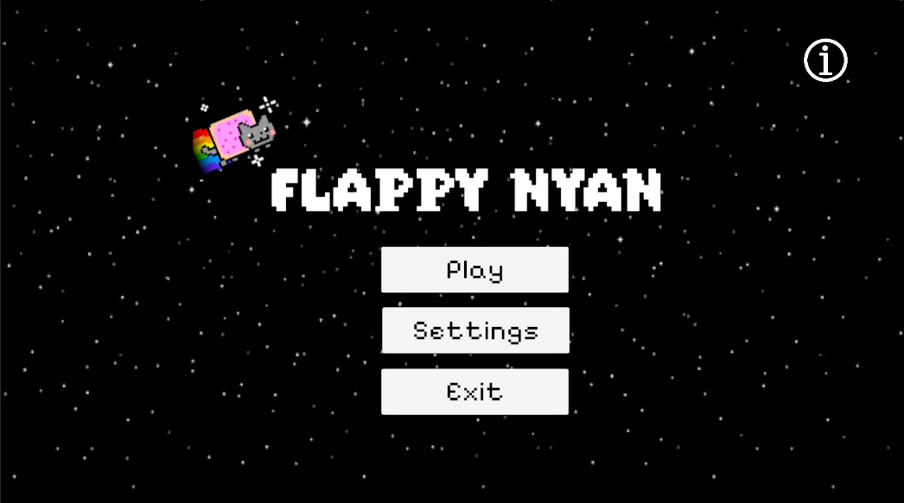
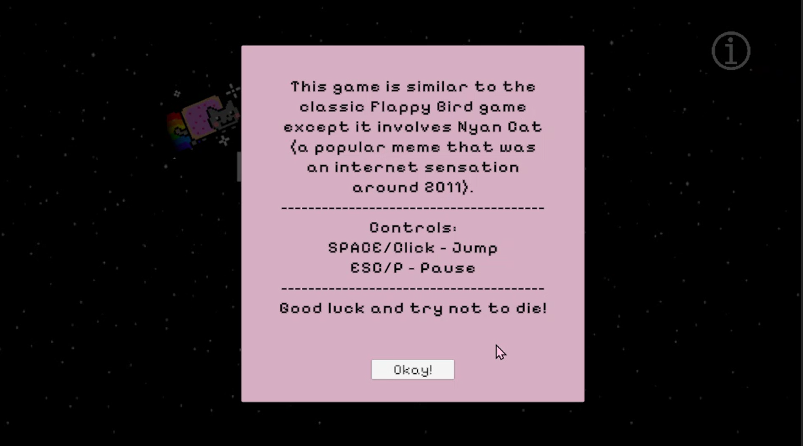
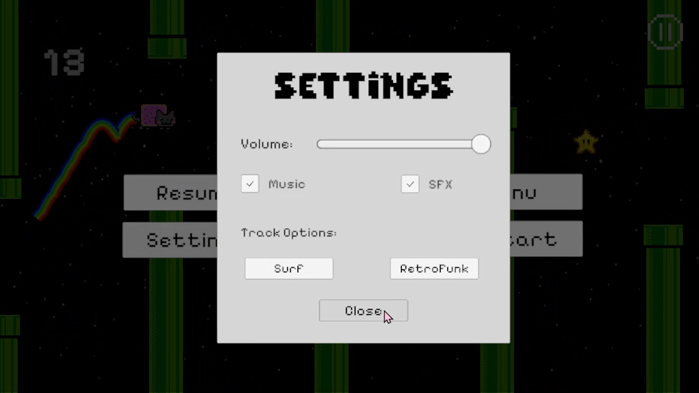
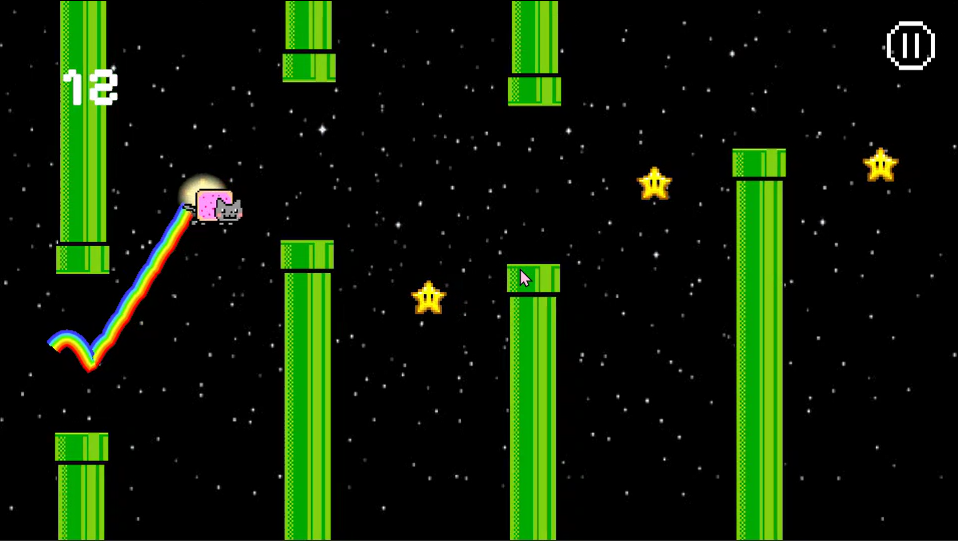
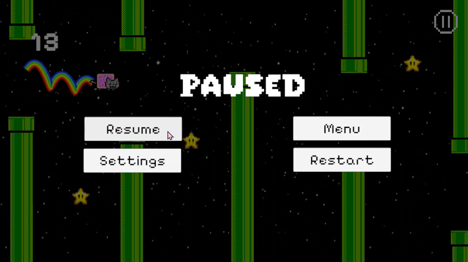
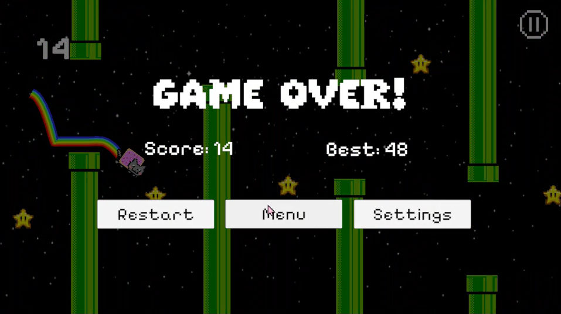

# Flappy Nyan Cat (Unity Game)

A 2D Flappy Bird–style game built in Unity using C#.  
Guide Nyan Cat through pipes, avoid collisions, collect stars, and try to beat your high score.

This project was developed as a personal portfolio project to practice game development, Unity systems, and C# scripting.

🎮 **[Play in Browser on Itch.io](https://nivedi06.itch.io/flappy-nyan-cat)**

---

## 🎮 Gameplay Preview

  
*Demonstration of gameplay, settings access, and UI navigation.*

---

## Features

- **Score tracking** with high score saving (`PlayerPrefs`)  
- **Main Menu**, Pause, and Game Over screens  
- **Audio system**  
  - Background music  
  - Sound effects  
  - Mute and volume control  
  - Music track switching  
- **Settings panel** accessible from menu and gameplay  
- **Increasing difficulty** as the score increases  
- **Scene management** between Menu and Game  
- **Persistent settings** across scenes  

---

## Tech Stack

- **Engine:** Unity  
- **Language:** C#  
- **UI:** TextMeshPro & Unity UI System  
- **Data Persistence:** PlayerPrefs (for saving high scores and audio settings)  

---

## Gameplay & Controls

- Press **Space** to make Nyan Cat jump  
- Avoid pipes and obstacles  
- Collect stars to increase your score  
- Game ends on collision with pipes  
- **Info Panel:** Access the info panel from the menu to see detailed instructions and game controls    
- Try to beat your **high score** each run

---

## How to Run Locally

1. Clone this repository to your local machine.
2. Open the project in **Unity Hub** (Developed using version: **6000.3.1f1**).  
3. Open the `MenuScene` located in your project scenes.  
4. Press **Play** in the Unity Editor.  

---

## Screenshots

> 💡 **Note on Platform Optimization:** The standalone desktop build includes an **Exit** button on the Main Menu. This button has been intentionally omitted from the live web build hosted on Itch.io, as browser-based games are optimized to be managed via browser tab controls.

### 🏠 Main Menu
  
*Main menu featuring Play, Settings, Exit, and Info (top-right corner).*

---

### ℹ️ Info Panel
  
*The overlay info panel explaining game controls and objectives to new players.*

---

### ⚙️ Settings Panel
  
*The settings menu featuring interactive volume sliders, music vs sfx toggles, and music track switching.*

---

### 🎮 Gameplay
  
*Nyan Cat avoiding pipes and collecting stars.*

---

### ⏸️ Game Paused
  
*Pause overlay menu accessible mid-game to quickly manage settings, resume play, restart, or go back*

---

### 💀 Game Over Screen
  
*Score tracking and real-time high score display.*

---

## 🏁 Project Status

This project is completed and serves as a polished portfolio piece demonstrating core Unity systems, UI state management, and C# scripting.

While minor visual quirks may exist depending on different browser environments, the project is stable and ready to play.